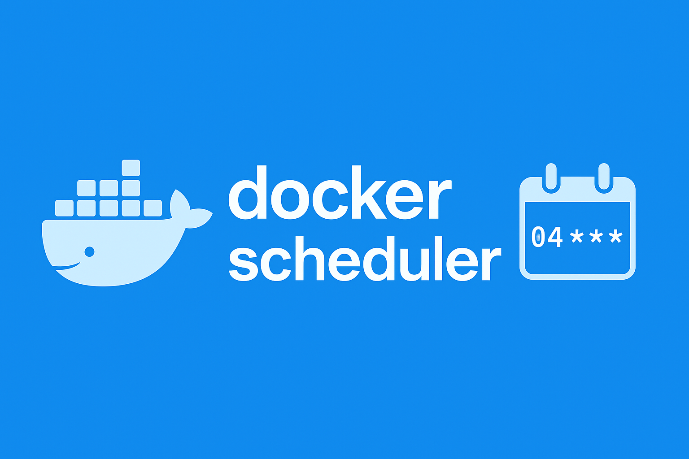

# docker_scheduler



## Description

**docker_scheduler** is a simple task scheduler for Docker containers. It executes scheduled (cron) tasks directly inside containers based on Docker labels — no external orchestrator or scheduler required.

You can assign special scheduler labels to your containers.
The scheduler container will read these labels and execute the defined commands at the specified times.

How it works:

 1. When the scheduler starts, it connects to the Docker socket.
 2. Then it reads the labels of all running containers. If any containers define scheduler labels, it registers the corresponding jobs in memory and executes them according to their schedule — similar to a traditional cron.
 3. The scheduler listens to docker events. Whenever a container is started, stopped, or updated, the scheduler re-evaluates its configuration and updates the active jobs accordingly.

---

*It is inspired by [Ofelia](https://github.com/mcuadros/ofelia). It is great
project, but it has one big disadvantage for me - it needs to be restarted when
applying changes in labels (at this time 5/2025). So I decided to write my own.*

---

## 🚀 Quick Start (for users)

If you just want to use the tool, you can pull the ready-to-use image from Docker Hub:

**Standalone**

```bash
docker run -d \
  -v /var/run/docker.sock:/var/run/docker.sock:ro \
  -e TZ=Europe/Prague \
  lukaskaplan/docker-scheduler
```

This runs docker_scheduler in a container with access to the Docker socket.

**... via `docker compose`**

Example `docker-compose.yaml` for `docker_scheduler`:

```yaml
services:
  scheduler:
    image: lukaskaplan/docker-scheduler
    volumes:
      - /var/run/docker.sock:/var/run/docker.sock:ro
    environment:
      TZ: Europe/Prague
```

Run `docker compose up -d`

---

## 🛠️ Usage

1. **Run docker_scheduler:**

(As shown above.)

2. **Label your containers with cron expressions:**

 - Each container can define one or more jobs via labels.
 - Each job must have a unique name (for this one container).

Example:

```yaml
services:
  your_container:
    image: your-image
    labels:
      # Turn on scheduler for this container:
      scheduler.enable: true

      # Replace <job-name> be name of the job:
      scheduler.<job-name>.schedule: "*/2 * * * *"
      scheduler.<job-name>.command: "echo Hello World!"

      # You can define multiple jobs:
      scheduler.backup.schedule: "0 2 * * *"
      scheduler.backup.command: "pg_dumpall -U postgres > /backup/db.sql"
      scheduler.cleanup.schedule: "0 4 * * *"
      scheduler.cleanup.command: "rm -rf /tmp/*"
```

3. **Check logs:**

```bash
docker logs -f <docker_scheduler_container_id>
```

---

## 🧪 For Developers

If you want to contribute or run the scheduler locally:

1. **Clone the repo:**

```bash
git clone https://github.com/lukaskaplan/docker_scheduler.git
cd docker_scheduler
```

2. **Create and activate a virtual environment:**

```bash
python3 -m venv venv
source venv/bin/activate
```

3. **Install dependencies:**

```bash
pip install -r requirements.txt
```

4. **Build the Docker conatiner:**

```bash
docker build . -t docker_scheduler
```

5. **Run the scheduler:**

```bash
docker run -it --rm -v /var/run/docker.sock:/var/run/docker.sock:ro -e TZ=Europe/Prague docker_scheduler
```

Ensure the Docker daemon is running and the socket is accessible.

---

## 📦 Docker Hub

Official Docker image:
[https://hub.docker.com/r/lukaskaplan/docker-scheduler](https://hub.docker.com/r/lukaskaplan/docker-scheduler)

---

## 📄 License

This project is licensed under the MIT License. See [LICENSE](LICENSE) for details.

---

## 🤝 Contributing

Contributions are welcome! If you have suggestions, issues, or ideas, please open an issue or pull request.
